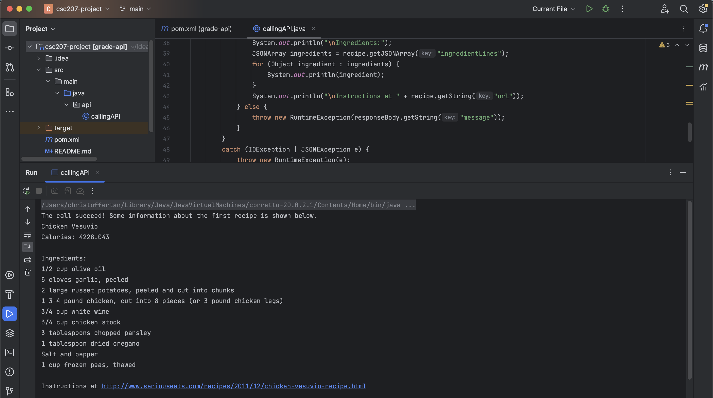

# csc207-project

## Problem domain
**Food and Nutrition**

A well-balanced meal is essential for a healthy life. However, choosing and preparing meals can often be a tedious task, and it can be challenging to make the right dietary decisions. People have varying dietary restrictions, allergies, and caloric needs, which further complicate the meal planning process. Our Meal Planner Application is designed to address these issues by automating the meal planning process and providing personalized meal plans based on individual preferences.

## Features

Our Meal Planner Application offers the following key features:
1. Personalized Meal Plans: Users can input their dietary preferences, such as vegan or Mediterranean, along with their caloric needs. The application then generates a customized meal plan that aligns with these preferences.
2. Allergy and Dietary Restriction Awareness: The application takes into account user allergies and dietary restrictions to ensure that the generated meal plans are safe and suitable.
3. Grocery Shopping List: To make meal preparation even more convenient, the app generates a shopping list of groceries required for the planned meals. This feature saves users time and streamlines the shopping process.
4. Calorie Tracking: Users can set calorie limits, helping them stay on track with their nutritional goals. The app ensures that meal plans adhere to these limits.

## Example
For example, the user can input to generate a meal plan that is vegan, Mediterranean, and has maximum of 2,000 calories. Our application will generate
a meal plan and the groceries list for a week accordingly.

## API Documentation
https://developer.edamam.com/edamam-docs-recipe-api

## Calling API Documentation

We request the API by using this following code:
```
String requestUrl = API_URL + "?type=" + type + "&q=" + q + "&app_id=" + APP_ID + "&app_key=" + APP_KEY;
        Request request = new Request.Builder()
                .url(requestUrl)
                .method("GET", null)
                .addHeader("Content-Type", "application/json")
                .build();
```
Then, we get the response given from API by using this following code:
```
Response response = client.newCall(request).execute();
            JSONObject responseBody = new JSONObject(response.body().string());
```
The full documentation of this process can be seen in the [callingAPI.java](src%2Fmain%2Fjava%2Fapi%2FcallingAPI.java) file